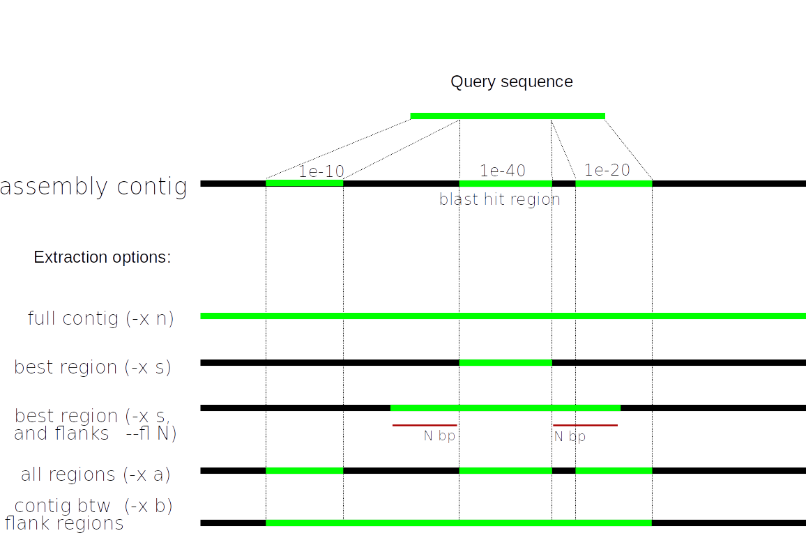
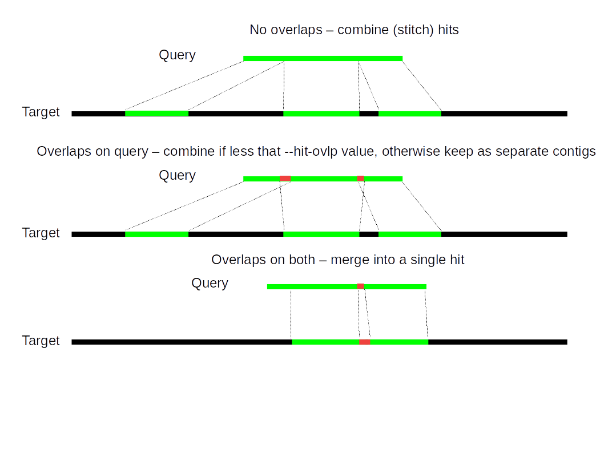
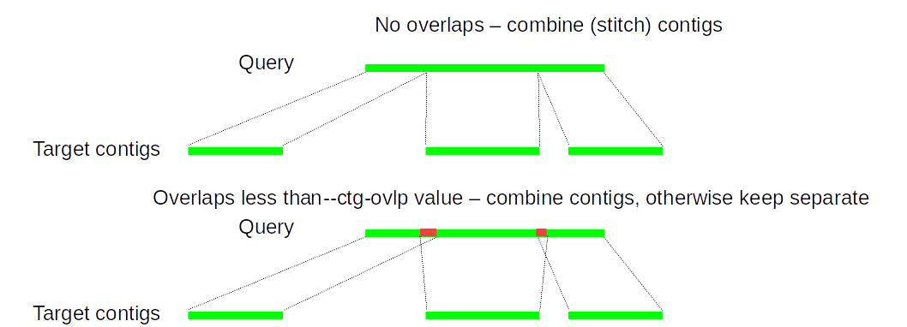
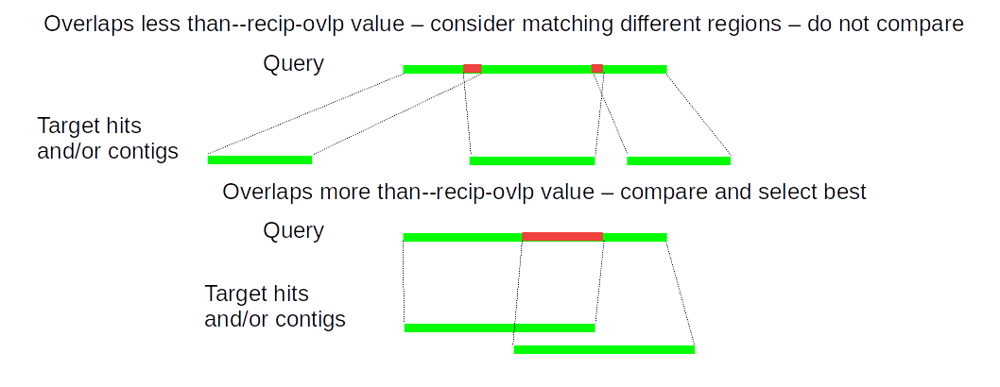

# ALiBaSeq
Alignment-Based Sequence extraction


### Table of Contents
* [References](https://github.com/AlexKnyshov/alibaseq#references)  
* [Description](https://github.com/AlexKnyshov/alibaseq#description)  
* [Dependencies](https://github.com/AlexKnyshov/alibaseq#dependencies)  
* [Installation](https://github.com/AlexKnyshov/alibaseq#installation)  
* [Workflow](https://github.com/AlexKnyshov/alibaseq#workflow)  
* [Other features and parameter description](https://github.com/AlexKnyshov/alibaseq#other-features-and-parameter-description)  
* [Log file description](https://github.com/AlexKnyshov/alibaseq#log-file-description)  
* [FAQ](https://github.com/AlexKnyshov/alibaseq#faq)  

## References

Alexander Knyshov, Eric R.L. Gordon, Christiane Weirauch (2020). New alignment-based sequence extraction software (ALiBaSeq) and its utility for deep level phylogenetics. bioRxiv 2020.04.27.064790; doi: https://doi.org/10.1101/2020.04.27.064790

The manuscript is based on the 1.1 version, available here: https://github.com/AlexKnyshov/alibaseq/releases/tag/v1.1

## Description
The core of the software - `alibaseq.py` - is designed to retrieve homologous regions from a FASTA file with contigs (e.g., an NGS read assembly file). The retrieval is done based on reading BLAST, HMMER, or LASTZ search tab-delimited output tables and then searching for the results in an assembly file. Software is designed to compile gene regions for phylogenetic inference (grouping all taxa being processed per locus and appending this data to given loci files), however this is not required and a different output structure can be selected. Optionally, a reverse search (reciprocal best hit check) table and a reference search (baits searched against a complete assembly / proteome of taxon they are derived from) table can be provided.
The following assumptions were used when developing the script:
* Technical
	- input (forward) search table has locus name or locus file name in the query column and contig name in the hit column
	- **in case of multiple samples processed at once**, input forward tables (baits against samples) located in the same folder, and named exactly as assemblies apart from having the following extensions appended: `.blast` for BLAST, `.hmmer` for HMMER, `.lastz` for LASTZ. Reciprocal search tables (samples against the reference sample) have suffix `_reciprocal.blast` appended to forward search table name, and located in the same or different folder as the forward search tables. Assemblies have extension `.fasta`. See examples below.
	- For the reference search table (baits against reference sample) BLAST or BED formats are supported.
	- if provided scripts are used for forward searches, bait files are to be organized one per locus in the same folder, with `.fas` extension
* Methodological
	- bait sequences can correspond to multiple hit regions in a given contig (a case of missing data or variable region in the bait, or intron presence in the sample contig)
	- bait sequences can correspond to multiple contigs in the assembly (a case of low-coverage assembly with broken up gene sequences)
	- no sequence fragment order rearrangements are assumed (in case of multiple hits or multiple contigs they are arranged as in the bait)
	- bait pool can contain paralogs or otherwise similar sequences; each contig region by default is checked to match only one bait, and pairing is done based on forward search similarity score and optionally reciprocal best hit score; multiple contigs may be paired with the same bait, but each contig region may only correspond to one bait (the check can be disabled).
	- paralogs can be located on the same contig in the assembly (since both contig name and coordinates are utilized to assign hits to queries, 'unused' regions of contigs can contribute to other loci)
	- nested genes can be extracted without disabling assembly contig 'usage check' if they share same general contig region but actual matching sequence regions are different (e.g., introns in one gene contain exons of another); alternatively a check for a given contig region to be used only once can be disabled, with all the consequences; both procedures require adjusting `--lr` option.


## Dependencies
Python 2 or 3, Biopython

## Installation
Clone the repository like this:
```
git clone https://github.com/AlexKnyshov/alibaseq.git
```

## Workflow

### Requirements:
- bait sequences in a single file or in multiple files, one file per locus (can contain multiple sequences); for multiple files, an extension `.fas` is assumed for the bait files.
- sample files (typically, assembled contigs) in FASTA format, a single file, or multiple files in the same folder
- if search to be using the wrapper scripts, the search programs (BLAST or HMMER) are in the path
- for BLAST searches, a database with the same name as the sample file was created in the same folder

### Conserved baits / genetically similar samples - DNA-based search

#### Single sample

<details>
<summary>Without reciprocal search</summary>
<p>

Create a blast database
```
makeblastdb -in assembly.fasta -dbtype nucl -parse_seqids
```
Perform the search
```
blastn -task dc-megablast -query baits.fas -db assembly.fasta \
-outfmt 6 -out assembly.fasta.blast -evalue 1e-10 -num_threads 1
```
Adjust E-value and number of threads approapriately

**ALTERNATIVE APPROACH (slower)** If baits are separate collections of FASTA sequences (e.g., locus alignments), located in the baits_folder, the search can be done with the following helper script, taking the first sequence from each file:
```
bash blast_wrapper.sh ./baits_folder/ assembly.fasta 1e-10 dc-megablast 1 n
```

Then run ALiBaSeq:
```
python alibaseq.py -x a -f S -b assembly.fasta.blast -t assembly.fasta \
 -e 1e-10 --is --amalgamate-hits
```

</p>
</details>

<details>
<summary>With a reciprocal search</summary>
<p>

Create a blast database for the sample
```
makeblastdb -in assembly.fasta -dbtype nucl -parse_seqids
```

Create a blast database for the reference sample
```
makeblastdb -in reference.fasta -dbtype nucl -parse_seqids
```

Search baits vs the sample
```
blastn -task dc-megablast -query baits.fas -db assembly.fasta -outfmt 6 \
-out assembly.fasta.blast -evalue 1e-10 -num_threads 1
```
Adjust E-value and number of threads appropriately

Search baits vs the reference sample, assuming that is the bait donor
```
blastn -query baits.fas -db reference.fasta -outfmt 6 \
-out reference.fasta.blast -num_threads 1
```
BED file can be used if the locations of bait regions are known

For the RBH check, the sample assembly needs to be searched against the reference assembly (or proteome). Since it takes longer and, as opposed to an OrthoMCL type orthology prediction, only sample contigs that had hits to the bait sequences will be considered, we suggest the following shortcut: only contigs appeared in the forward search are reciprocally searched against the reference taxon. This can be done as follows:
```
bash reciprocal_search.sh assembly.fasta.blast assembly.fasta \
reference.fasta dc-megablast 1 n reciprocal_get_contigs.py
```
Adjust the number of threads appropriately

Then run ALiBaSeq:
```
python alibaseq.py -x a -f S -b assembly.fasta.blast -t assembly.fasta \
-e 1e-10 --is --amalgamate-hits -r assembly.fasta.blast_reciprocal.blast \
-R reference.fasta.blast
```

</p>
</details>

#### Multiple samples

<details>
<summary>Without reciprocal search</summary>
<p>

For a group of files, located in the same folder, the dbs can be created like this
```
for f in folder_with_assemblies/*.fasta
do
	makeblastdb -in $f -dbtype nucl -parse_seqids
done
```
Perform the search
```
mkdir blast_results
for f in folder_with_assemblies/*.fasta
do
	blastn -task dc-megablast -query baits.fas -db $f -outfmt 6 \
	-out $f".blast" -evalue 1e-10 -num_threads 1
	mv "folder_with_assemblies/"$f".blast" ./blast_results/
done
```
Adjust E-value and number of threads approapriately


**ALTERNATIVE APPROACH (slower)** If baits are separate collections of FASTA sequences (e.g., locus alignments), located in the baits_folder, the search can be done with the following helper script, taking the first sequence from each file. But at first a list of sample files needs to be created.
```
ls folder_with_assemblies/*.fasta | rev | cut -f1 -d/ | rev > list_of_files_to_seach_against.txt
bash blast_wrapper.sh ./query_folder/ ./folder_with_assemblies/ 1e-10 \
dc-megablast 1 n ./list_of_files_to_seach_against.txt
mkdir blast_results
mv *.blast blast_results
```

Then run ALiBaSeq:
```
python alibaseq.py -x a -f M -b ./blast_results/ -t ./folder_with_assemblies/ \
-e 1e-10 --is --amalgamate-hits
```

</p>
</details>

<details>
<summary>With a reciprocal search</summary>
<p>

For a group of files, located in the same folder, the dbs can be created like this
```
for f in folder_with_assemblies/*.fasta
do
	makeblastdb -in $f -dbtype nucl -parse_seqids
done
```
Create a blast database for the reference sample
```
makeblastdb -in reference.fasta -dbtype nucl -parse_seqids
```
Perform the forward search
```
mkdir blast_results
for f in folder_with_assemblies/*.fasta
do
	blastn -task dc-megablast -query baits.fas -db $f \
	-outfmt 6 -out $f".blast" -evalue 1e-10 -num_threads 1
	mv "folder_with_assemblies/"$f".blast" ./blast_results/
done
```
Adjust E-value and number of threads appropriately

Search baits vs the reference sample, assuming that is the bait donor
```
blastn -query baits.fas -db reference.fasta -outfmt 6 \
-out reference.fasta.blast -num_threads 1
```
BED file can be used if the locations of bait regions are known

Perform the reciprocal search
```
bash reciprocal_search.sh blast_results folder_with_assemblies \
reference.fasta dc-megablast 1 n reciprocal_get_contigs.py \
list_of_files_to_seach_against.txt
```
Adjust the number of threads appropriately

Then run ALiBaSeq:
```
python alibaseq.py -x a -f M -b blast_results -t folder_with_assemblies \
-e 1e-10 --is --amalgamate-hits -r blast_results -R reference.fasta.blast
```

</p>
</details>

### Variable baits / genetically distant samples - Protein-based search

DNA baits are assumed. If baits are protein, replace tblastx commands below with tblastn

#### Single sample

<details>
<summary>Without reciprocal search</summary>
<p>

Create a blast database
```
makeblastdb -in assembly.fasta -dbtype nucl -parse_seqids
```
Perform the search
```
tblastx -query baits.fas -db assembly.fasta \
-outfmt 6 -out assembly.fasta.blast -evalue 1e-10 -num_threads 1
```
Adjust E-value and number of threads approapriately

**ALTERNATIVE APPROACH (slower)** If baits are separate collections of FASTA sequences (e.g., locus alignments), located in the baits_folder, the search can be done with the following helper script, taking the first sequence from each file:
```
bash blast_wrapper.sh ./baits_folder/ assembly.fasta 1e-10 tblastx 1 n
```

Then run ALiBaSeq:
```
python alibaseq.py -x a -f S -b assembly.fasta.blast -t assembly.fasta \
 -e 1e-10 --is --amalgamate-hits --ac tdna-tdna
```

</p>
</details>

<details>
<summary>With a reciprocal search</summary>
<p>

Create a blast database for the sample
```
makeblastdb -in assembly.fasta -dbtype nucl -parse_seqids
```

Create a blast database for the reference sample
```
makeblastdb -in reference.fasta -dbtype nucl -parse_seqids
```

Search baits vs the sample
```
tblastx -query baits.fas -db assembly.fasta -outfmt 6 \
-out assembly.fasta.blast -evalue 1e-10 -num_threads 1
```
Adjust E-value and number of threads appropriately

Search baits vs the reference sample, assuming that is the bait donor
```
blastn -query baits.fas -db reference.fasta -outfmt 6 \
-out reference.fasta.blast -num_threads 1
```
BED file can be used if the locations of bait regions are known

For the RBH check, the sample assembly needs to be searched against the reference assembly (or proteome). Since it takes longer and, as opposed to an OrthoMCL type orthology prediction, only sample contigs that had hits to the bait sequences will be considered, we suggest the following shortcut: only contigs appeared in the forward search are reciprocally searched against the reference taxon. If tblastx search takes too long, or requires a lot of resources (typically only for large and highly contiguous assembly), a dc-megablast search can be performed instead.
```
bash reciprocal_search.sh assembly.fasta.blast assembly.fasta \
reference.fasta tblastx 1 n reciprocal_get_contigs.py
```
Adjust the number of threads appropriately

Then run ALiBaSeq:
```
python alibaseq.py -x a -f S -b assembly.fasta.blast -t assembly.fasta \
-e 1e-10 --is --amalgamate-hits -r assembly.fasta.blast_reciprocal.blast \
-R reference.fasta.blast --ac tdna-tdna --acr tdna-tdna
```

</p>
</details>

#### Multiple samples

<details>
<summary>Without reciprocal search</summary>
<p>

For a group of files, located in the same folder, the dbs can be created like this
```
for f in folder_with_assemblies/*.fasta
do
	makeblastdb -in $f -dbtype nucl -parse_seqids
done
```
Perform the search
```
mkdir blast_results
for f in folder_with_assemblies/*.fasta
do
	tblastx -query baits.fas -db $f -outfmt 6 \
	-out $f".blast" -evalue 1e-10 -num_threads 1
	mv "folder_with_assemblies/"$f".blast" ./blast_results/
done
```
Adjust E-value and number of threads approapriately


**ALTERNATIVE APPROACH (slower)** If baits are separate collections of FASTA sequences (e.g., locus alignments), located in the baits_folder, the search can be done with the following helper script, taking the first sequence from each file. But at first a list of sample files needs to be created.
```
ls folder_with_assemblies/*.fasta | rev | cut -f1 -d/ | rev > list_of_files_to_seach_against.txt
bash blast_wrapper.sh ./query_folder/ ./folder_with_assemblies/ 1e-10 \
tblastx 1 n ./list_of_files_to_seach_against.txt
mkdir blast_results
mv *.blast blast_results
```

Then run ALiBaSeq:
```
python alibaseq.py -x a -f M -b ./blast_results/ -t ./folder_with_assemblies/ \
-e 1e-10 --is --amalgamate-hits --ac tdna-tdna
```

</p>
</details>

<details>
<summary>With a reciprocal search</summary>
<p>

For a group of files, located in the same folder, the dbs can be created like this
```
for f in folder_with_assemblies/*.fasta
do
	makeblastdb -in $f -dbtype nucl -parse_seqids
done
```
Create a blast database for the reference sample
```
makeblastdb -in reference.fasta -dbtype nucl -parse_seqids
```
Perform the forward search
```
mkdir blast_results
for f in folder_with_assemblies/*.fasta
do
	tblastx -task dc-megablast -query baits.fas -db $f \
	-outfmt 6 -out $f".blast" -evalue 1e-10 -num_threads 1
	mv "folder_with_assemblies/"$f".blast" ./blast_results/
done
```
Adjust E-value and number of threads appropriately

Search baits vs the reference sample, assuming that is the bait donor
```
blastn -query baits.fas -db reference.fasta -outfmt 6 \
-out reference.fasta.blast -num_threads 1
```
BED file can be used if the locations of bait regions are known

Perform the reciprocal search
```
bash reciprocal_search.sh blast_results folder_with_assemblies \
reference.fasta tblastx 1 n reciprocal_get_contigs.py \
list_of_files_to_seach_against.txt
```
Adjust the number of threads appropriately

Then run ALiBaSeq:
```
python alibaseq.py -x a -f M -b blast_results -t folder_with_assemblies \
-e 1e-10 --is --amalgamate-hits -r blast_results -R reference.fasta.blast \
--ac tdna-tdna --acr tdna-tdna
```

</p>
</details>

### HMMER profiles

<details>
<summary>Single sample DNA-based example without a reciprocal search</summary>
<p>

We highly recommend using the `--domtblout` output format of HMMER whenever possible, since it provides detailed information about domains detected (for the purposes of alibaseq, those are equivalent to HSP in BLAST and LASTZ).

Perform the forward search
```
> assembly.fasta.hmmer
for f in ./hmmer_profiles/*.hmm
do
	hmmsearch --cpu 1 -E 1e-10 --tformat fasta --domtblout temp.hmmer $f assembly.fasta
	cat temp.hmmer >> assembly.fasta.hmmer
done
rm temp.hmmer
```

Then run ALiBaSeq, domain format of HMMER corresponds to `--bt hmmer22` option in ALiBaSeq:
```
python alibaseq.py -x a -f S -b assembly.fasta.hmmer -t assembly.fasta \
-e 1e-10 --is --amalgamate-hits --bt hmmer15
```

</p>
</details>

<details>
<summary>Single sample protein-based example without a reciprocal search</summary>
<p>

WIP

</p>
</details>

## Other features and parameter description

### workflow / directory pointers                        

option `-f` specifies whether a single alignment table, or multiple tables are used. In the latter, only the path to the folder needs be specified. (MANDATORY, NO DEFAULT)

option `-b` specifies the path to alignment table file or a folder with such tables. When multiple tables are used, match between the table and the assembly is done based on cutting out `.blast` extension from the table and using the resulting name to search for the assembly file. (MANDATORY, NO DEFAULT)

option `-t` specifies the path to the sample file (when `-f S`) or to the folder with sample files. Filename matching is done as described for `-b` option. (default: None, switches off sequence output, only table output of what would be extracted)

option `-q` specifies the path to the folder with query file(s) to which extracted results are to be appended. (default: None, output sequences are written to empty files)

option `-o` specifies the name of the output folder to be created; previous content is erased. (default: alibaseq_out)

option `-r` specifies path to the reciprocal search output table file or the folder with such files. In case of multiple files, match is done based on suffix `_reciprocal.blast`. (default: None)

option `-R` specifies path to the query search against the reference assembly. (default: None)

### table type

option `--bt` specifies the alignment table type (only for forward searches; reciprocal and reference tables are always parsed as `blast`). `blast` is a standard blast table, `hmmer22` is a --domtblout table of hmmer, `hmmer18` is a protein --tblout table of hmmer, `hmmer15` is a dna --tblout table of hmmer. (default: blast)

option `--ac` specifies the alignment table type. `dna-dna` is default, and has no special effects, except is not allowed to run with `--bt hmmer18` as the latter is a protein table. In `tdna-tdna`, `tdna-aa` and `aa-tdna` overlapping hits are checked for frameshift before joining. When set to `tdna-aa` or `aa-tdna`, coordinates of blast tables are modified accordingly to convert between AA and NT values. In `tdna-aa` and `aa-aa` output sequence translation is not allowed. (default: dna-dna)

option `--acr` specifies the alignment table type for reciprocal search table (supplied with `-r`), see `--ac` for details. (default: dna-dna)

option `--acR` specifies the alignment table type for the reference table (supplied with `-R`), see `--ac` for details. (default: dna-dna)

### extraction parameters

option `-x` specifies the extraction type: `n` extracts the whole contig, `s` extracts only single best hit, `a` extracts all hit regions and joins them together, `b`extracts region between two outmost hit regions. (MANDATORY, NO DEFAULT)



option `-c` specifies the max number of (super)contigs to extract. When set to 0, all matched supercontigs will be extracted. If a single (best matching) contig needs to be extracted, `-c` should be set to 1. If a set of one or several closely similar hits to be extracted, should be set to -1 (`-c=-1`) (default: 1) 

option `--fl` specifies flanks on each side in bp. This option is only available when `-x` is set to `s` or `b`. (default: 0)

option `--translate` turns on sequence translation (for `-x s` or `-x a`), only works when appropriate `--ac`. (default: False)

option `--om` specifies the way sequences are output. When set to `query`, sequences are grouped into per query files, when set to `target`, they are grouped into per sample files, and when set to `combined`, all sequences from all tables are extracted into a single file. (default: query)

option `--keep-strand` turns off sequence reversal according to the query and outputs sequence in original direction (only has effect in combination with `-x n`). (default: False)

### scoring

option `-e` specifies the evalue cutoff. Nothing will be considered above this cutoff as it filters out initial alignment table parsing. (default: 0.01)

option `-B` specifies the bitscore cutoff. Nothing will be considered below this cutoff as it filters out initial alignment table parsing. (default: 0.0)

option `-i` specifies the identity cutoff. Nothing will be considered below this cutoff as it filters out initial alignment table parsing. (default: 0.0)

option `-m` specifies the order of metrics to be used for discriminating between hits/contigs (e - evalue, b - bitscore, i - identity); by default the evalue and bitscore differentials are compared and if not congruent, identitry is used for final decision. (default: e/b-i)

option `--rescale-metric` rescales the metric value by the length of the match (not recommended for most situations since bitscore and evalue already incorporate hit sizes) (default: False)

option `--hmmer-global` - for hmmer22 tables only - uses contig scores instead of domain (hit) scores; do not use in combination with `--amalgamate-hits` (default: False)

### hit stitcher

option `--hit-ovlp` specifies max allowed hit overlap on query, 0 or >= 1 in bp, or relative 0 < N < 1. If two hits overlap more than this amount, and overlap on the sample contig is greater than 0, the hits are considered to be indeed overlapping. (default: 0.1)



option `--amalgamate-hits` - when scoring the contig, use combination of scores of the hits and their average identity (default: False)

option `--metric-merge-corr` - used together with `--amalgamate-hits` to reduce the combined score of multiple hits (default: 1.0)

option `--no-hs` prevents running hit stitcher on the forward search table (default: False)

option `--ref-hs` turns on hit sticher on the reciprocal table (slow). Typically reciprocal table is much larger, and takes considerable amount of time to parse. The alternative, default, approach is for a given sample contig region to simply pick the best hit to reference that is located in the same region. (default: False)

option `--max-gap` (if greater than 0) specifies the maximum distance between hits of a contig, if greater hits are split into alternative versions of the same sample contig; setting to 0 turns off (default: 0)

### contig stitcher

option `--is` turns on contig stiching. (default: False)

option `--ctg-ovlp` specifies max allowed contig overlap on query, 0 or >= 1 in bp, or relative 0 < N < 1. If two contigs overlap more than this amount they are considered to be indeed overlapping. (default: 0.2)



### homology checks

option `--lr` specifies local single best match check (prevents same part of the sample contig being extracted to multiple queries). When set to `range`, each region of the sample contig (after joining multiple hits) is allowed to be matched to only one query. When set to `actual`, individual hits are checked for the same condition prior to being joined together. Can be switched off by setting `none`. (default: range)

option `--both-strands 1` treats different strands of the same contig region as potentially separate loci and not be removed by the local homology check. `--both-strands 0` allows only one best strand for each contig to be considered. (default: 1)

option `--recip-ovlp` specifies max allowed hit/contig overlap on query for reciprocal check (both "local" and "global" checks), 0 or >= 1 in bp, or relative 0 < N < 1. If two hits/contigs overlap more than this amount, they are considered to be sufficiently overlapping to pick only one best out of the two. (default: 10)



option `--rm-rec-not-found` turns on the STRICT RBH check, by not considering contig regions that are found in forward search but not in reverse search or in the reference search; by default, missing data equates to contig passing reciprocal best match criterion (RELAXED RBH check) (default: False)

option `--srt` can be used to adjust the definition of the close suboptimal hits, via the ratio of log(E value) and ratio of bit scores between two hits. If ratio is greater than the supplied values, two hits are considered to be similar enough for the paralog warning and the `-c=-1` suboptimal hit extraction option purposes. (default: 0.9)
 

## Log file description

The following log files are output
* `alibaseq_<suffix>.log` contains generic information about the parameters used to run the script, reference sample processed (if any), and summary data on each sample processed.
* `<sample name>_<logsuffix>.log` contains information about processing an individual sample
* `<sample name>_<logsuffix>_qtable.tab` contains per-query (bait) information about an individual sample. The format is described in the subsection below.
* `<sample name>_<logsuffix>_ttable.tab` is a comma-delimited file, contains per-contig information about an individual sample. Each line corresponds to the contig used in the first column, number of baits it contributed to in the second column, and bait names in the subsequent columns

### qtable log format
Each line of the log corresponds to a bait sequence and its extracted match from the sample assembly. Below is the description, nested constructs are expanded for readability using markdown lists. Direction `True` means the same strand, `False` - an opposite strand. `<contig_name>@<index>` together comprise a "pseudocontig" - a particular instance of an original contig, with its own start/end coordinates and direction. HSP regions are listed in order they would be arranged during sequence extraction. Note that these HSPs may be different from the original search program HSP regions, as some may have been merged. Gap value represents gap between hits of the same contig, as well as between different contigs, as assessed based on query sequence. Negative gap values denote overlap.
* `<bait_name> [`
	* `[<supercontig_index>, [`
		* `[True],`
		* `[<supercontig_evalue>, <supercontig_bitscore>, <supercontig_identity>],`
		* `[<supercontig_start_on_bait>,<supercontig_end_on_bait>], [`
			* `[<contig_name>@<index>, [`
				* `[<pseudocontig_direction>], `
				* `[<pseudocontig_evalue>, <pseudocontig_bitscore>, <pseudocontig_identity>], `
				* `[<pseudocontig_start_on_sample_contig>, <pseudocontig_end_on_sample_contig>, 
				<pseudocontig_start_on_bait>, <pseudocontig_start_on_bait>], [`
					* `[<HSP_start_on_sample_contig>, <HSP_end_on_sample_contig>, 
					<HSP_start_on_bait>, <HSP_end_on_bait>, 
					<HSP_evalue>, <HSP_bitscore>, <HSP_identity>], `
					* `<gap>,` 
					* `[<another HSP>], `
					* `<gap>,`
					* `...`
					* `[<last HSP>]`
				* `]`
			* `]],`
			* `<gap>,`
			* `[... another pseudocontig] `
		* `]`
	* `]],`
	* `[... another supercontig]`
* `]`

## FAQ

*What kinds of datasets are suitable for AliBaSeq?*

Any kind of genetic datasets in which you want to analyse a subset of loci for a phylogeny. The subset may include predetermined single copy orthologous genes (BUSCO or OrthoDB), predetermined genes for which probes are supposed to enrich loci (targeted capture, UCE or AHE approaches) or even other datasets in which you want to recover a set of known genes for new taxa for further analysis. 

It can be used on transcriptomic, low coverage or well-assembled genomic data or sequence capture assemblies. It is especially useful for combining these different types of data for a comprehensive phylogenetic analysis. It is also particularly robust for recovering genes across large phylogenetic distances unlike many other programs.

*What is the best search tool (BLAST/HMMER/LASTZ) to use for my dataset before using AliBaSeq?* 

If baits are similar enough to the samples, DNA-based searches should be used, as they are fast and lack the risk of increased false-positive results. Tools like blastn, blastn -task dc-megablast, nhmmer, hmmsearch with DNA profiles, and LASTZ can all be used, with BLAST being one of the fastest and easiest to set up and use.

If baits are divergent from the samples, DNA-based tools are suggested to be tried first, but it is likely that even discontinuous megablast might not give enough hits. In this case, or when only protein bait sequences are available, protein-based searches need to be conducted. The easiest options are tblastn (if baits are protein) and tblastx (if baits are CDS) searches, they are relatively fast and easy to set up. If multiple bait sequences are desired to be used, for example when looking for difficult loci with large variation even between reference taxa, HMMER profiles can be used instead. DNA-based HMMER search is straightforward to set up. Potein-based search would require producing six-frame-translated copies of sample assemblies, and the search would likely take longer (it runs best if it is possible to MPI-parallelize it as on a compute cluster, the tutorials are coming up...).

*If I want to recover a set of pre-determined loci from newly sequences transcriptomes what default parameters would I use? What parameters might I adjust to get better recovery?*

Depending on the contiguity of the transcriptomic assembly, use of the contig stitcher may be unnecessary. Lowering the evalue, bitscore, and identity thresholds may help with recovery of divergent hits.

*If I want to recover a set of pre-determined loci from newly sequenced low coverage genome data what default parameters would I use? What parameters might I adjust to get better recovery?*

A whole genome assembly produced from short reads is in our experience not very contiguous. If baits permit (i.e., they target putatively single-copy divergent from each other loci), the contig stitcher may help with recovery of larger regions. If a protein search is used, --hit-ovlp and --ctg-ovlp should be increased in our experience to about 30-40bp. This will help recovering larger sequences, at the expense of having larger unmatching 'splash zones' between the exons. Trimming those via after generation fo the multiple sequence alignment (MSA) or exonerate is possible. Lowering the evalue, bitscore, and identity thresholds may help with recovery of divergent hits.

*If I want to recover a set of pre-determined loci from newly sequenced target capture data what default parameters would I use? What parameters might I adjust to get better recovery?*

If the capture targeted shorter regions (e.g., UCE), the same simple procedure as for transcriptomes can be used. If the capture targeted longer multiexon genes, it depends on the size of the introns. In AHE projects, introns are typically small, thus the assembly would likely have a complete target region for a given bait in a single contig, thus making the contig stitcher unnecessary. However, if introns were large and the assembly becomes discontinuous, the contig stitcher may help. See the low coverage genome question for details. Another caveat with hybrid capture data using assembly of all reads is the lack of reference to read coverage. While for UCE data (which uses a similar `assemble > search for contigs` approach) this empirically appears to have little problems, theoretically low coverage contaminants (either other samples or other organisms in a given sample) may be erroneously picked up. Thus it may be reasonable after the assembly stage to filter low covered contigs either from the assembly or from the resulting blast table (e.g., Velvet and Spades append k-mer coverage to contig names).

*What is the best way to assess different parameters I've used to determine which ones work the best in terms of low false positive rates and maximum recovery?*

It is hard to come up with an accurate way to assess the false positive rate for an empirical study, where the true homolog sequence is unknown. But typically false positives manifest themselves in downstream analyses. If false positives are a problem (for example, when using a protein bait on a divergent organism), using the RBH check is highly recommended. For divergent from bait organisms or very low coverage genomes a strict RBH check as well as using tblastx for the reciprocal searches are recommended. Additionally, it is recommended to experiment with the scoring options (`-m` and `--rescale-metric`, `--amalgamate-hits`, and `--metric-merge-corr`).
The recovery may be assessed by the number of hits recovered, as well as by looking at coverage breadth of loci at the alignment stage. If recovery is not sufficient, while false-positives are not a problem, lowering the search sequence similarity thresholds as well as using a relaxed RBH check may help. If recovery is patchy from exon to exon, `--hit-ovlp` might need to be increased. If it is hard to get a good balance between the recovery and the false positive rates, assuming the sample was sequenced well, the bait sequence set may need to be adjusted (use more similar baits, avoid loci with known paralogs)

*I work on a non-model organism and I have a very low coverage genome but I want to include it in a phylogenetic analysis with some well relatively well sequenced trancriptomes from the same kind of organism without any annotations. What is the best way to test out the program to see if it works for me?*

ALiBaSeq is designed for the datasets that have predetermined bait (loci) set. If no baits are available for the set of transcriptomes, transcripts can be turned into putative proteins and subjected to an all-vs-all orthology prediction (e.g., OrthoMCL). Alternatively, an available bait set can be used (OrthoDB, UCE, AHE, other publicly available loci sets). In this case, after getting the bait file with bait sequences formatted (see workflow or in the test folder), BLAST/HMMER/LASTZ searches can be done and ALiBaSeq can be then used to process the search results. Since the genome sample will likely require different parameters, we recommend to process it separately from the transcriptomes (one after another). We also recommend using a reciprocal search, for which a reference taxon would be needed. If baits used came from a different source and the assembly / transcriptome / proteome of the bait donor organism is no available, one of the sample transcriptomes (ideally, the most complete one) can be used as the reference. In addition to the baits vs samples searches, the baits vs reference sample search (same way as bait vs sample) as well as reciprocal search (sample vs reference sample) should be performed (see workflow).

*Aren't UCEs and AHE loci very different? Why didn't you evaluate AHE loci?* 

In vertebrates, UCEs appear to be a unique sequence element that doesn't code for proteins. In invertebrates, the most highly conserved sequences are almost entirely exonic and are part of a protein coding sequence. 

*Will this program work for pulling out vertebrate UCEs?* 

Yes!.... but probably almost all alternatives will work well too. An advantage of ALiBaSeq is flexibility with respect to search tools used and the way user data is organized.

